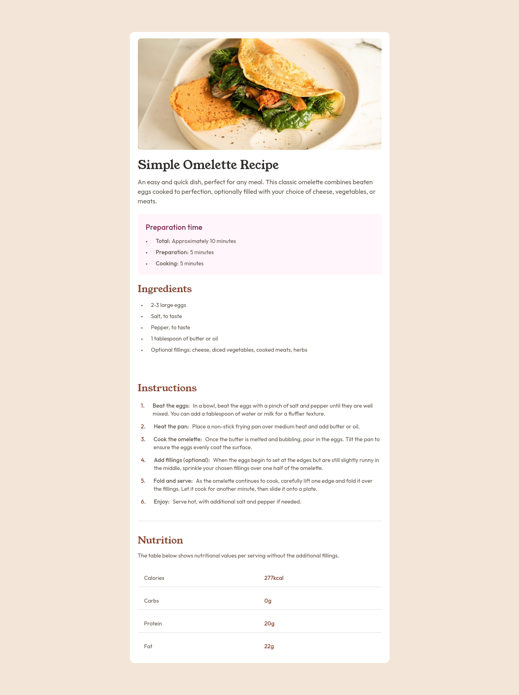
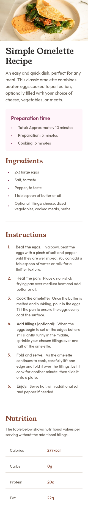

# Frontend Mentor - Recipe page solution

This is a solution to the [Recipe page challenge on Frontend Mentor](https://www.frontendmentor.io/challenges/recipe-page-KiTsR8QQKm).

## Table of contents

- [Overview](#overview)
  - [The challenge](#the-challenge)
  - [Screenshot](#screenshot)
  - [Links](#links)
- [My process](#my-process)
  - [Built with](#built-with)
  - [What I learned](#what-i-learned)
- [Author](#author)
- [Acknowledgments](#acknowledgments)

## Overview

### The challenge

The challenge is to build out this recipe page and get it looking as close to the design as possible.

### Screenshot

  
Recipe page (Desktop view)

  

    
  

  
Recipe page (mobile view)

  

    
  

### Links

- Solution URL: [Recipe page](https://g-uriarte.github.io/fm-recipe-page/)
- Live Site URL: [Recipe page](https://g-uriarte.github.io/fm-recipe-page/)

## My process

### Built with

- Semantic HTML5 markup
- Flexbox
- [React](https://reactjs.org/) - JS library
- Typescript
- [Taildwindcss](https://tailwindcss.com/) - For styles

### What I learned

- Created variant using plugin with tailwindcss.
- Use dvh and dvw (css)

## Author

- Frontend Mentor - [@g-uriarte](https://www.frontendmentor.io/profile/g-uriarte)